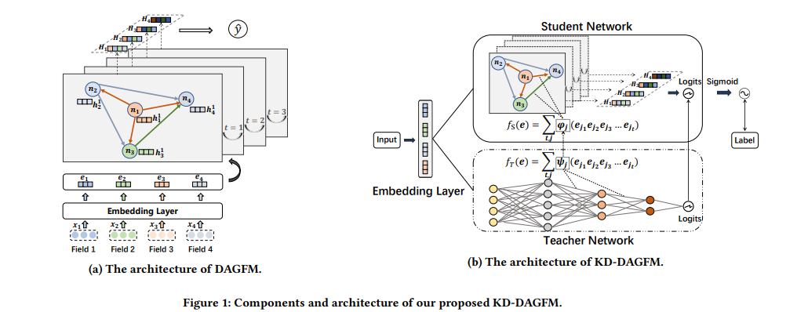

# KD-DAGFM

This is the official PyTorch implementation for the [paper](https://arxiv.org/abs/2211.11159):
> Zhen Tian, Ting Bai, Zibin Zhang, Zhiyuan Xu, Kangyi Lin, Ji-Rong Wen and Wayne Xin Zhao. Directed Acyclic Graph Factorization Machines for CTR Prediction via Knowledge Distillation. WSDM 2023.


## Overview

we propose a **D**irected **A**cyclic **G**raph **F**actorization **M**achine (**KD-DAGFM**) to learn the high-order feature interactions from existing complex interaction models for CTR prediction via **K**nowledge **D**istillation.
The proposed lightweight student model **DAGFM** can learn arbitrary explicit feature interactions from teacher networks, which achieves approximately lossless performance and is proved by a dynamic programming algorithm.



## Requirements

```
tensorflow==2.4.1
python==3.7.3
cudatoolkit==11.3.1
pytorch==1.11.0
```

## Download Datasets and Processing

Please download the datasets from [Criteo](http://labs.criteo.com/2014/02/kaggle-display-advertising-challenge-dataset/), [Avazu](https://www.kaggle.com/c/avazu-ctr-prediction/data) and [MovieLens-1M](https://drive.google.com/drive/folders/1so0lckI6N6_niVEYaBu-LIcpOdZf99kj?usp=sharing), put them in the /DataSource folder.

Pre-process the data.
```
python DataSource/[dataset]_parse.py
```
Then divide the dataset.
```
python DataSource/split.py
```

## Quick Start

### Train the teacher model


```
python train.py --config_files=[dataset]_kd_dagfm.yaml --phase=teacher_training
```

### Distillation

```
python train.py --config_files=[dataset]_kd_dagfm.yaml --phase=distillation --warm_up=/Saved/[teacher_file]
```

### Finetuning

```
python train.py --config_files=[dataset]_kd_dagfm.yaml --phase=finetuning --warm_up=/Saved/[Student_file]
```

## Maintainers
Zhen Tian. If you have any questions, please contact 1204216974@qq.com.
